# frontend-mobile-portfolio
Frontend Portfolio
## 1. Redline – Car Service App (React Native/Expo)
**Live client app for garage staff: Job tracking, service management, billing & thermal printing.**

<div align="center">

### Dashboard & Services
**Login → Main Service List** (Client data – no live credentials available)
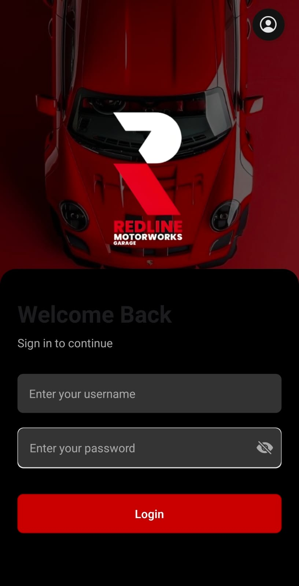 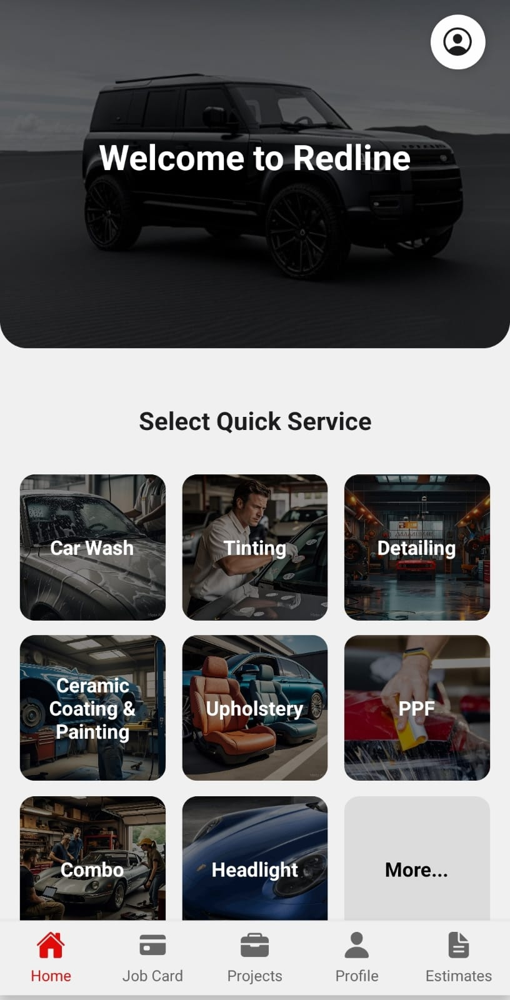 ```

Job Cards Management
Assign services to employees with full vehicle details

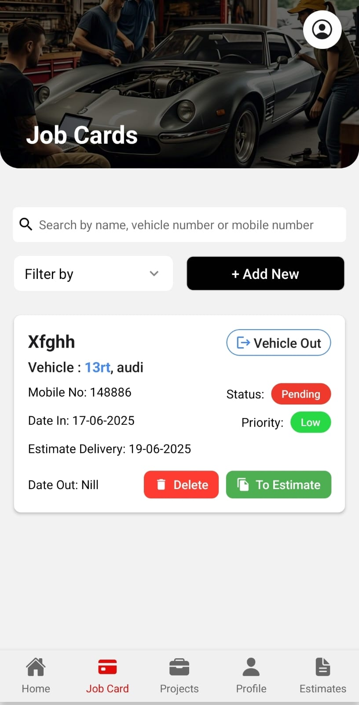
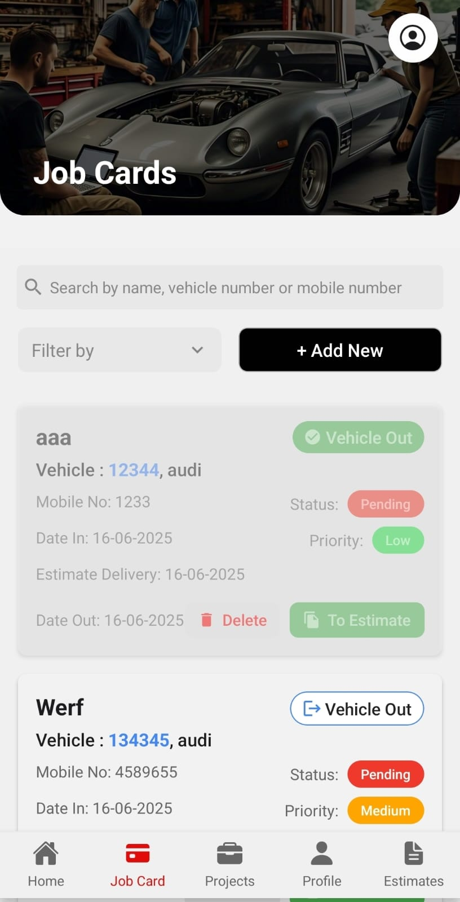

Quick Services & Estimates
Service catalog → Quick actions → Delivery scheduling → Estimates

Services List	Quick Service (Car Wash)	Delivery Date
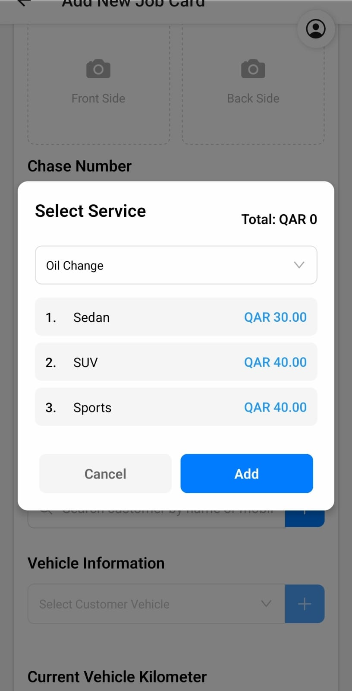	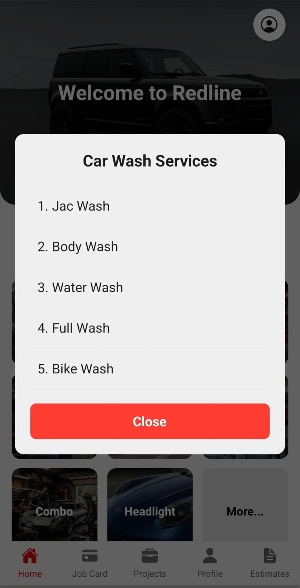	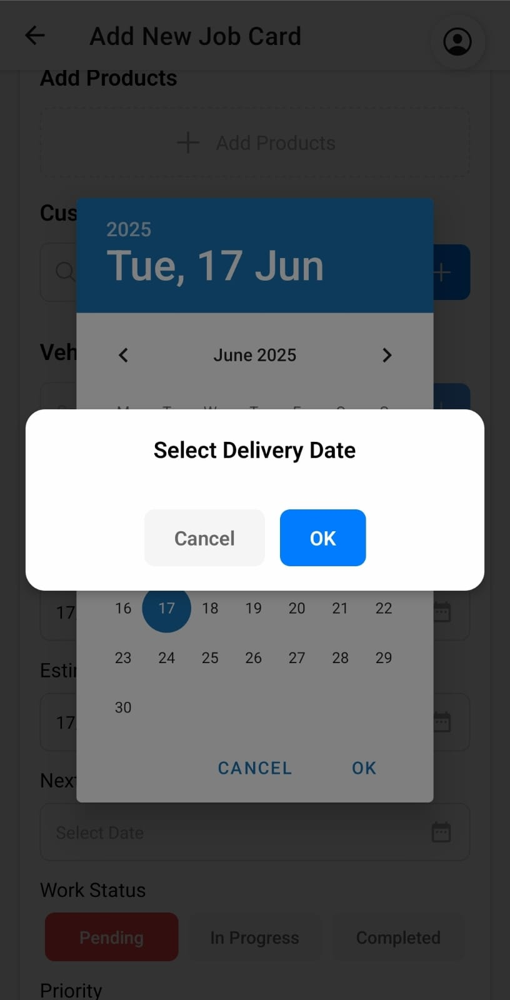

Sub-Services	Vehicle Details	Estimate Approval
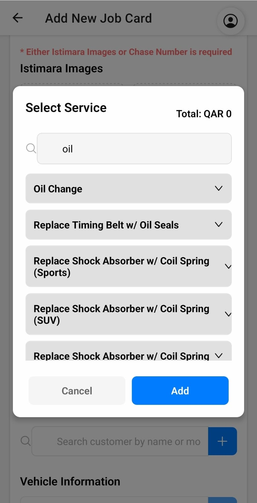	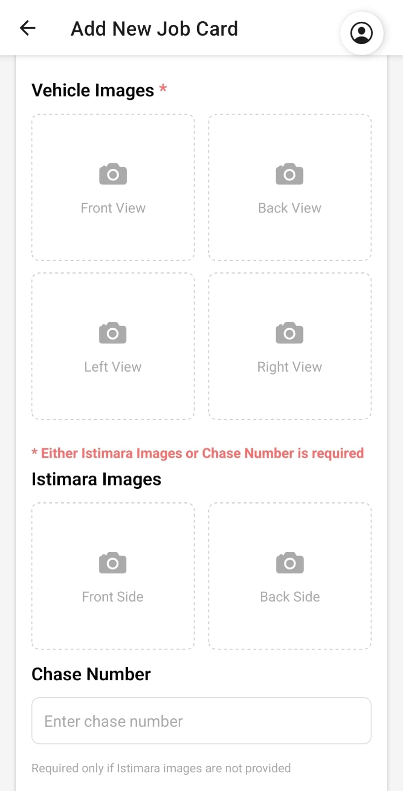	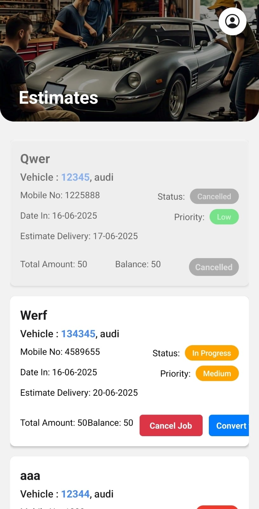

Invoicing & Printing
Full service bills + Quick print for simple jobs

Main Service Bill	Quick Print Flow
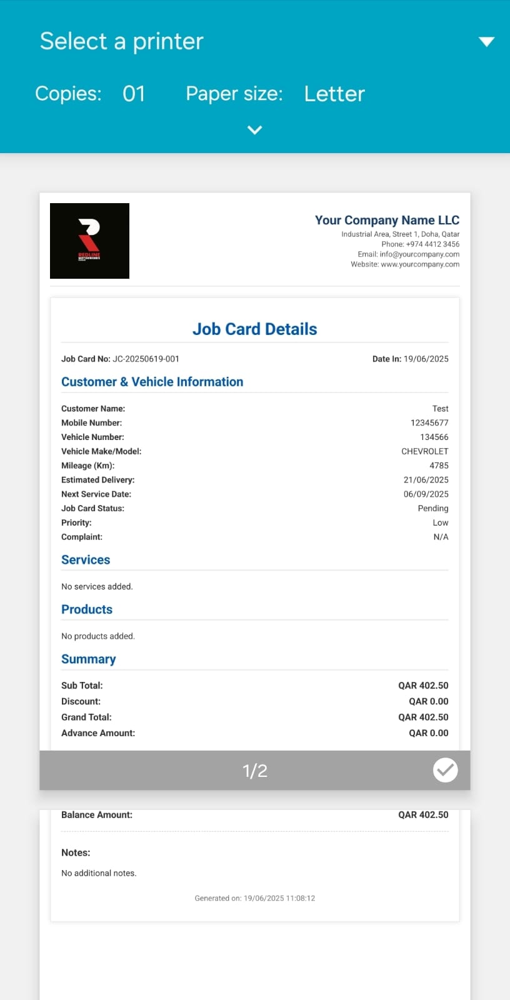	

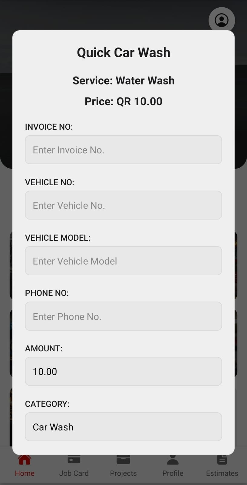
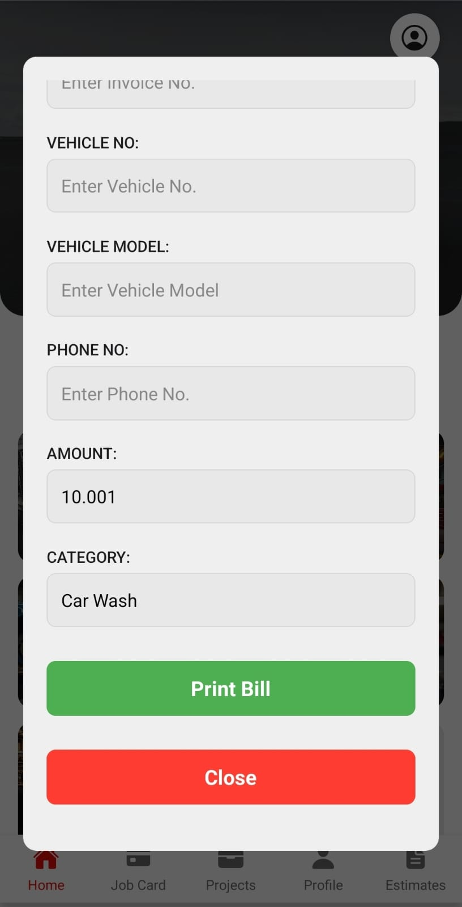

</div>
Supermarket Relevance: Service catalogs → product categories, job cards → orders, thermal printing → receipts, estimates → dynamic pricing.

Tech: Expo SDK 53, Material UI, responsive design. Production-ready for POS systems.


  ## 2. RentalApp – Flutter Inventory
**Client-specified simple, clean design for rental inventory management with stock tracking, billing, and thermal printing.**

### User Flow
1. **Browse & Select Items** – View available rentals with search and current stock levels.
2. **Enter Details** – Add customer info, select dates, capture photos (ID/vehicle).
3. **Generate Bill** – Calculate totals with discounts/advance, print receipt.
4. **View Reports** – Filter rentals by date/status (pending/paid).
5. **Manage Stock** – Add/update inventory items and quantities.

<div align="center">

  **Home Screen and available items screen**  
 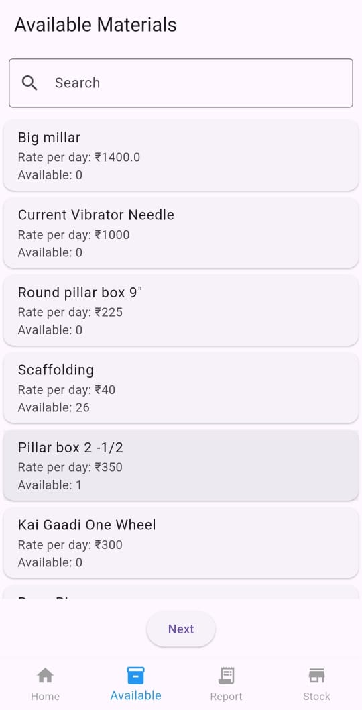

**Item Selection**  
 

**Customer Details**  
 

**Bill Generation**  


**Rental Reports**  


**Stock Management**  


</div>


**Supermarket Relevance:** Product catalog → available items list, receipt printing, inventory updates, sales reports by date.


## 3. DohaPride Driver – Taxi Dispatch App
**Real-time trips, maps, status updates.**

### Key Screens & Design Approach
- **Dashboard/Trips** : Map integration, real-time lists – delivery tracking.
  
[!trip](dohapride/home.jpeg)

- **Trip Details** : Status badges, car details – order status.
  
[!trip](dohapride/trip-detail.jpeg)
[!trip](dohapride/start-endoption.jpeg)
[!trip](dohapride/driver-detail.jpeg)
-
- **End Trip** : Image upload, confirmation – proof of delivery.
  
 [!trip]( dohapride/end-trip)

**Patterns for Supermarket:** Searchable lists, maps for stores, modals for quick actions.

## Relevance to Supermarket App
- **Inventory:** Job cards → Product lists with filters/images.
- **Checkout:** Service modals → Cart/add products.
- **Billing:** Thermal invoices → Receipts/POS printing.
- **UX:** Dark mode, responsive, intuitive for staff/clients.


