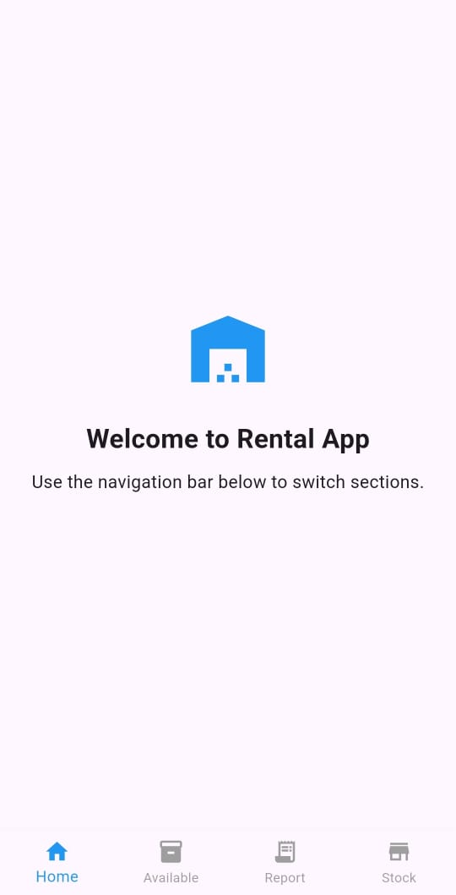
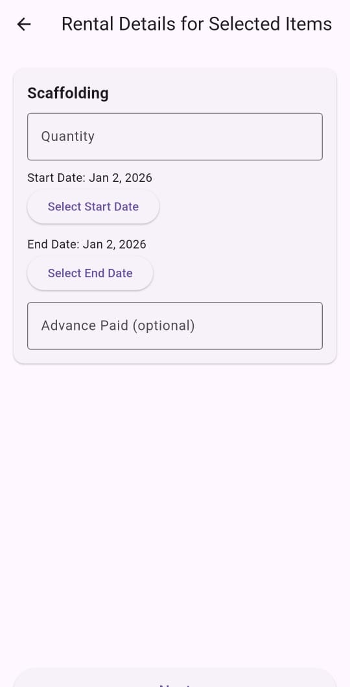
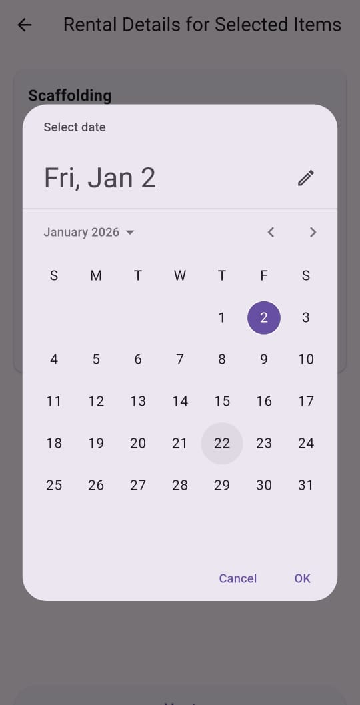
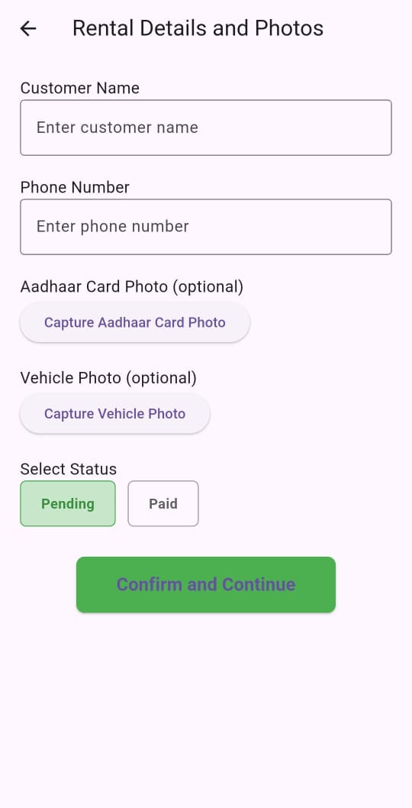
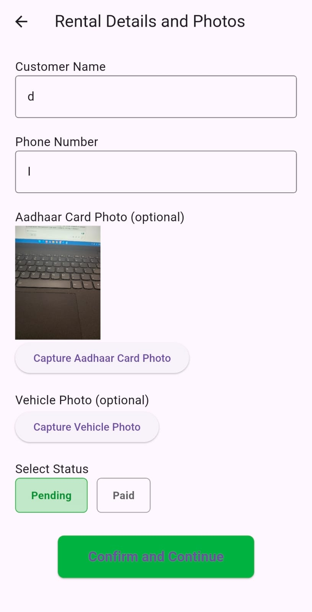
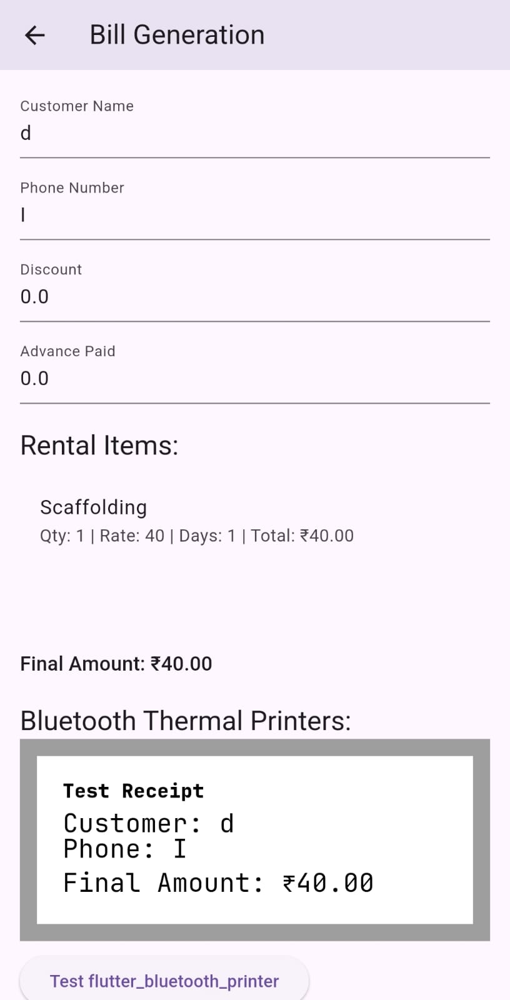
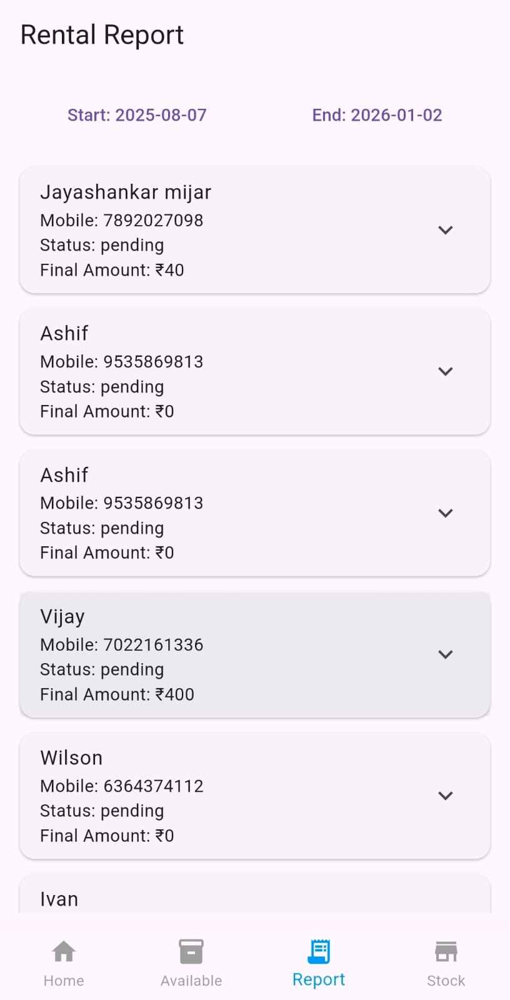
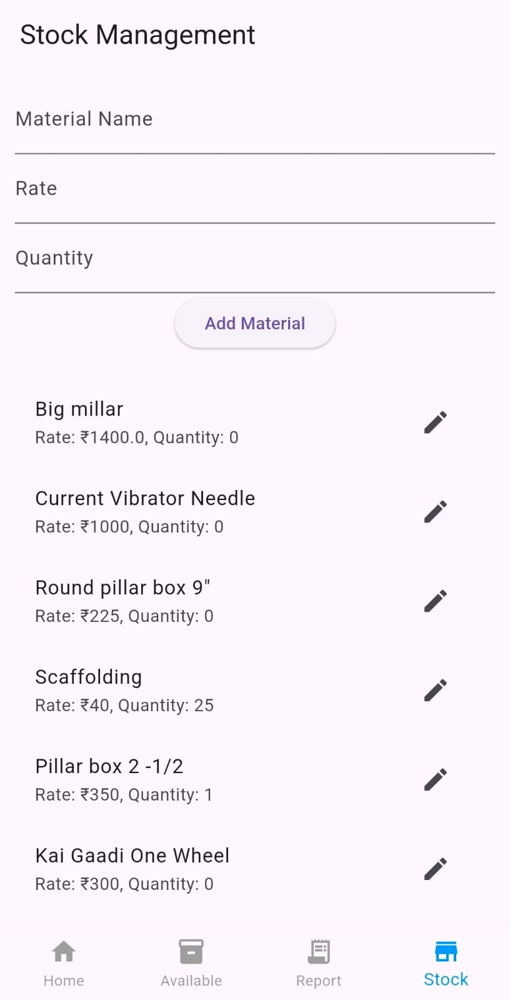

# frontend-mobile-portfolio
Frontend Portfolio
# Redline Car Service App (React Native/Expo)

**Live client app for garage staff: Job tracking, billing, printing.** 

## Design Flows
### 1. Onboarding & Dashboard
![Splash & Login][file:178][file:169]
- Hero imagery, secure auth modals.

### 2. Job Cards Management
![Add Job][file:170][file:171]
- Search/filter lists, priority badges, vehicle images/chassis validation.

### 3. Quick Services & Estimates
![Services][file:173][file:174]
- Service catalogs, dynamic pricing, date pickers.

### 4. Invoicing & Printing
![Invoices][file:176][file:177]
- Customizable bills, thermal printer integration.

**Tech:** Expo SDK 53, Material UI, responsive modals. Adaptable to supermarket POS/carts.
### Key Screens & Design Approach
- **Dashboard/Services** [file:178][file:173]: Grid layouts, dynamic pricing – like supermarket categories/carts.
- **Job Cards** [file:170][file:171]: Search/filter, priority badges, multi-image upload – inventory management.
- **Modals/Forms** [file:176][file:177]: Date pickers, service selectors – checkout flows.
- **Invoices/Printing** [file:172][file:174]: Custom bills, printer integration – receipts.

![Job Cards List][file:180][file:182]
![Add Job Modal][file:170]

## 2. DohaPride Driver – Taxi Dispatch App [file:184][file:185]
**Real-time trips, maps, status updates.**

### Key Screens & Design Approach
- **Dashboard/Trips** [file:186][file:187]: Map integration, real-time lists – delivery tracking.
- **Trip Details** [file:188][file:189]: Status badges, car details – order status.
- **End Trip** [file:190]: Image upload, confirmation – proof of delivery.

![Today Trips][file:186]
![Trip Card][file:187]

**Patterns for Supermarket:** Searchable lists, maps for stores, modals for quick actions.

## Relevance to Supermarket App
- **Inventory:** Job cards → Product lists with filters/images.
- **Checkout:** Service modals → Cart/add products.
- **Billing:** Thermal invoices → Receipts/POS printing.
- **UX:** Dark mode, responsive, intuitive for staff/clients.

  ## 3. RentalApp – Flutter Inventory
**Client-specified simple, clean design for rental inventory management with stock tracking, billing, and thermal printing.**

### User Flow
1. **Browse & Select Items** – View available rentals with search and current stock levels.
2. **Enter Details** – Add customer info, select dates, capture photos (ID/vehicle).
3. **Generate Bill** – Calculate totals with discounts/advance, print receipt.
4. **View Reports** – Filter rentals by date/status (pending/paid).
5. **Manage Stock** – Add/update inventory items and quantities.

| Home Screen & Available Items | Item/Date Selection |
|-------------------------------|---------------------|
| {width=300px} |     |

| Customer Details | Bill & Reports |
|------------------|----------------|
|     |        |

**Supermarket Relevance:** Product catalog → available items list, receipt printing, inventory updates, sales reports by date.
